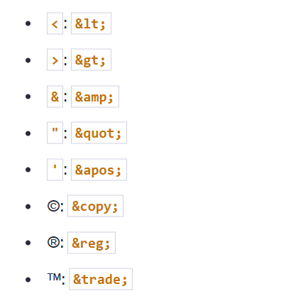

# Article on HTML Chapter 11
## Semantic Elements in HTML: A Comprehensive Guide

Semantic HTML elements provide meaning to the content they enclose, making it more understandable for both browsers and developers. In this article, we'll explore semantic elements in HTML, their importance, and how to use them effectively.

## What is a Semantic Element?
Semantic elements are HTML elements that clearly describe their meaning in the document structure. They provide context to the content they contain, making it easier for developers to understand and for browsers to interpret.

## List of Semantic Elements
&lt;header&gt;: Defines a header for a document or section.

&lt;nav&gt;: Defines navigation links.

&lt;main&gt;: Defines the main content of a document.

&lt;article&gt;: Defines an independent piece of content.

&lt;section&gt;: Defines a section in a document.

&lt;aside&gt;: Defines content aside from the content (like a sidebar).

&lt;footer&gt;: Defines a footer for a document or section.

&lt;details&gt;: Defines additional details that the user can view or hide.

&lt;summary&gt;: Defines a heading for the &lt;details&gt; element.

&lt;figure&gt;: Defines self-contained content, like images or diagrams.

Layout Creative Semantic Elements
Semantic elements can be creatively used to structure the layout of a web page, improving its readability and accessibility.

```html
<header>
    <h1>Website Title</h1>
    <nav>
        <ul>
            <li><a href="#">Home</a></li>
            <li><a href="#">About</a></li>
            <li><a href="#">Services</a></li>
            <li><a href="#">Contact</a></li>
        </ul>
    </nav>
</header>
 
<main>
    <section>
        <h2>About Us</h2>
        <p>Content about the website.</p>
    </section>
 
    <section>
        <h2>Services</h2>
        <p>Our services include...</p>
    </section>
</main>
 
<aside>
    <h3>Latest Updates</h3>
    <ul>
        <li>Update 1</li>
        <li>Update 2</li>
        <li>Update 3</li>
    </ul>
</aside>
 
<footer>
    <p>&copy; 2024 Website Name. All rights reserved.</p>
</footer>
```

## HTML Recommendation
Using semantic HTML elements is recommended by the W3C for better structure, accessibility, and search engine optimization (SEO).

## Complete HTML Characters Details
HTML provides special character entities to display characters that have special significance in HTML. Here are some commonly used HTML characters:



By using semantic HTML elements effectively, developers can create well-structured, accessible, and SEO-friendly web pages, improving both user experience and search engine ranking.